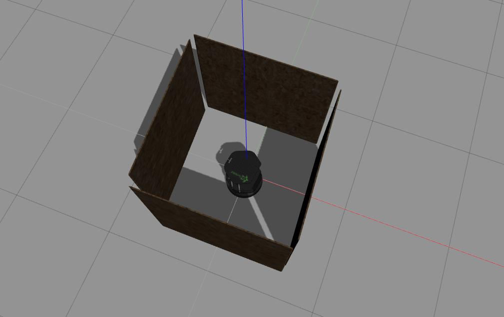

# Obstacle Avoidance Turtlebot
[](https://opensource.org/licenses/GPL-3.0)

## Overview

This repository is made for course ENPM808X where a simple walker algorithm is implmented which is like a Roomba robot vacuum cleaner. The robot moves forward until it reaches an obstacle (not colliding), and then rotate in place until the way ahead is clear, then move forward again and repeat. This project depends on the following:

    ROS kinetic : To install ROS refer [ROS installation page] (http://wiki.ros.org/kinetic/Installation/Ubuntu)
    Catkin : To install catkin refer [catkin installation page] (http://wiki.ros.org/catkin?distro=kinetic#Installing_catkin)
    Gazebo : To install gazebo refer [Gazebo installation page] (http://gazebosim.org/tutorials?tut=install_ubuntu&cat=install)
    Turtlebot : To install turtlebot package refer [Turtlebot introduction page] (http://wiki.ros.org/Robots/TurtleBot/kinetic)

## Build Instructions

We are assuming that the dependencies are met, so we now follow the below mentioned commands on terminal to clone this repository:
```
mkdir -p ~/catkin_ws/src
cd ~/catkin_ws
catkin_make
source ~/devel/setup.bash
cd src
git clone https://github.com/namangupta98/obstacle_avoidance_turtlebot.git
cd ..
catkin_make
```

## Run Instructions

Now, we use launch file to run. In a new terminal, type 

```
cd catkin_ws
source devel/setup.bash
roslaunch obstacle_avoidance_turtlebot algo.launch
```
This will open gazebo simulation of turtlebot avoiding obstacles and turning anti-clockwise for every obstacle. The below of the screenshot of how it will look




## Rosbag

The rosbag recording is disabled by default so when you type

```
roslaunch obstacle_avoidance_turtlebot algo.launch
```
Only launch file is executed. To generate a new rosbag file type 

```
roslaunch obstacle_avoidance_turtlebot algo.launch recordRosbag:=true
```
A bag file will be created in Results directory which is recorded for 15 seconds. It will record all the topics except from camera. To inspect ROS bag file first stop the current execution by Ctrl+C and then type: 

```
cd src/obstacle_avoidance_turtlebot/results
rosbag info rec.bag 
```

To play the ROS bag file, first run rosmaster in a new terminal and in the previous terminal type

```
rosbag play rec.bag
```
You will see that the message stored in bagfile is running for 15seconds.
